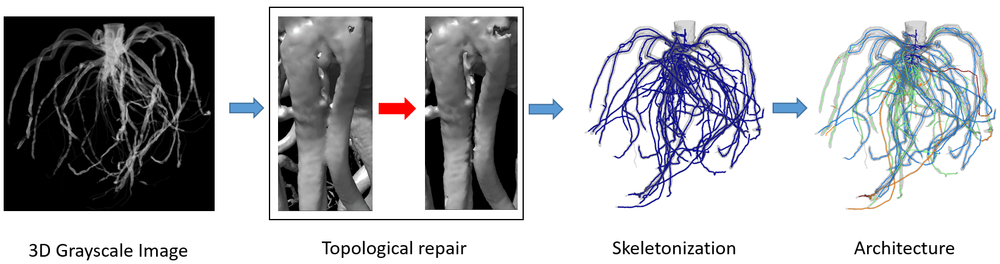

# TopoRoot: An automatic pipeline for plant architectural analysis from 3D Imaging

## Introduction
TopoRoot is a pipeline of geometric algorithms for automatically obtaining architectural traits from 3D grayscale images of plant structures both above and below the soil, with high accuracy and throughput. Our pipeline may be applied to batch process large numbers of 3D images, potentially for the purpose of genetic phenotyping studies, or can be applied to individual images. For the first time, we bring state-of-the-art techniques from computer graphics to resolve several topological and geometric issues which are frequently encountered in image-to-analysis pipelines for plant phenotyping. These contributions include:
* The removal of excessive topological features from the shape which is reconstructed from the imaging. These topological features include merged branches, disconnected components, noise, and internal voids, which are removed by our pipeline with minimal geometric change, using the method in [Zeng et. al, 2020].
* The representation of the plant structure by a curve skeleton known as the medial axis. This allows for a compact graph representation of the plant's structure using nodes and edges, while also encoding shape information such as thickness and width. These characteristics make our pipeline more amenable to computing architecture. We use the medial axis computation and skeleton pruning techniques introduced in [Yan et. al, 2018] and [Yan et. al, 2016].
* A novel algorithm for computing the hierarchy of the plant structure, which recursively minimizes that maximum branching depth of the predicted structure of the plant at each hierarchy level. Our algorithm also considers branch length and angle continuity.
* An algorithm for identifying the stem / tiller of the plant structure which uses the thickness information along the medial axis. This was previously used in [Li et. al, 2020] as a step of the algorithm to identify primary branches, as part of a comprehensive 3D phenotypic study which revealed continuous morphological variation across diverse sorghum influorescences. Here we extend the stem identification algorithm to also be able to track multiple tillers, which can be seen in structures such as sorghum roots

Further details about these steps can be found in our ['NAPPN presentation (National Plant Phenotyping Network Conference 2021)'](https://github.com/danzeng8/TopoRoot/blob/master/pics/NAPPN_2021_danzeng.pptx)

## Installation

The steps of installation consist of downloading this code repository, building a few C++ projects, and ensuring the proper python version is installed.

1. Download this repository by either clicking on Code > Download Zip in the top right, and then unzipping, or by using the git clone https://github.com/danzeng8/TopoRoot.git command.

Running Instructions:

This pipeline can be run either in batch (a directory), or one file at a time. 

To run in batch, run a root_pipeline_batch.py as follows:

python root_pipeline_batch.py -i <input directory> -o <output directory> -d <downsampling rate>

Example:
python root_pipeline_batch.py -i C:/Users/danzeng/Sorghum/Roots/batch/ -o C:/Users/danzeng/Sorghum/Roots/batch_out/ -d 6

Running it in this way assumes the folder contains raw files, each with a corresponding .dat file in the same directory, with the exact same name (besides the extension).

Output:

A .csv file in the format

Sample 1 Name, level 1 branch count, level 1 average length, level 1 average geodesic depth, level 1 average radius, level 1 number of skeleton edges, level 1 average tortuosity, level 1 angle to gravity, level 1 angle to parent, level 1 tip angle, level 1 emergence angle, level 1 midpoint angle, level 1 branch children, level 2 branch count, level 2 average length, level 2 average geodesic depth, level 2 average radius, level 2 number of skeleton edges, level 2 average tortuosity, level 2 angle to gravity, level 2 angle to parent, level 2 tip angle, level 2 emergence angle, level 2 midpoint angle, level 2 branch children, level 3 branch count, level 3 average length, level 3 average geodesic depth, level 3 average radius, level 3 number of skeleton edges, level 3 average tortuosity, level 3 angle to gravity, level 3 angle to parent, level 3 tip angle, level 3 emergence angle, level 3 midpoint angle, level 3 branch children, level 4 branch count, level 4 average length, level 4 average geodesic depth, level 4 average radius, level 4 number of skeleton edges, level 4 average tortuosity, level 4 angle to gravity, level 4 angle to parent, level 4 tip angle, level 4 emergence angle, level 4 midpoint angle, level 4 branch children, level 5 branch count, level 5 average length, level 5 average geodesic depth, level 5 average radius, level 5 number of skeleton edges, level 5 average tortuosity, level 5 angle to gravity, level 5 angle to parent, level 5 tip angle, level 5 emergence angle, level 5 midpoint angle, level 5 branch children, 
total branch length, total number of branches, total average branch length, total skeleton edges, average angle to gravity, average parent angle, average tip angle, average emergence angle, average midpoint angle, average number of children
Sample 2 Name, level 1 branch count, level 1 average length, level 1 average geodesic depth, level 1 average radius, level 1 number of skeleton edges, level 1 average tortuosity, level 1 angle to gravity, level 1 angle to parent, level 1 tip angle, level 1 emergence angle, level 1 midpoint angle, level 1 branch children, level 2 branch count, level 2 average length, level 2 average geodesic depth, level 2 average radius, level 2 number of skeleton edges, level 2 average tortuosity, level 2 angle to gravity, level 2 angle to parent, level 2 tip angle, level 2 emergence angle, level 2 midpoint angle, level 2 branch children, level 3 branch count, level 3 average length, level 3 average geodesic depth, level 3 average radius, level 3 number of skeleton edges, level 3 average tortuosity, level 3 angle to gravity, level 3 angle to parent, level 3 tip angle, level 3 emergence angle, level 3 midpoint angle, level 3 branch children, level 4 branch count, level 4 average length, level 4 average geodesic depth, level 4 average radius, level 4 number of skeleton edges, level 4 average tortuosity, level 4 angle to gravity, level 4 angle to parent, level 4 tip angle, level 4 emergence angle, level 4 midpoint angle, level 4 branch children, level 5 branch count, level 5 average length, level 5 average geodesic depth, level 5 average radius, level 5 number of skeleton edges, level 5 average tortuosity, level 5 angle to gravity, level 5 angle to parent, level 5 tip angle, level 5 emergence angle, level 5 midpoint angle, level 5 branch children, 
total branch length, total number of branches, total average branch length, total skeleton edges, average angle to gravity, average parent angle, average tip angle, average emergence angle, average midpoint angle, average number of children
....
Sample N Name, level 1 branch count, level 1 average length, level 1 average geodesic depth, level 1 average radius, level 1 number of skeleton edges, level 1 average tortuosity, level 1 angle to gravity, level 1 angle to parent, level 1 tip angle, level 1 emergence angle, level 1 midpoint angle, level 1 branch children, level 2 branch count, level 2 average length, level 2 average geodesic depth, level 2 average radius, level 2 number of skeleton edges, level 2 average tortuosity, level 2 angle to gravity, level 2 angle to parent, level 2 tip angle, level 2 emergence angle, level 2 midpoint angle, level 2 branch children, level 3 branch count, level 3 average length, level 3 average geodesic depth, level 3 average radius, level 3 number of skeleton edges, level 3 average tortuosity, level 3 angle to gravity, level 3 angle to parent, level 3 tip angle, level 3 emergence angle, level 3 midpoint angle, level 3 branch children, level 4 branch count, level 4 average length, level 4 average geodesic depth, level 4 average radius, level 4 number of skeleton edges, level 4 average tortuosity, level 4 angle to gravity, level 4 angle to parent, level 4 tip angle, level 4 emergence angle, level 4 midpoint angle, level 4 branch children, level 5 branch count, level 5 average length, level 5 average geodesic depth, level 5 average radius, level 5 number of skeleton edges, level 5 average tortuosity, level 5 angle to gravity, level 5 angle to parent, level 5 tip angle, level 5 emergence angle, level 5 midpoint angle, level 5 branch children, total branch length, total number of branches, total average branch length, total skeleton edges, average angle to gravity, average parent angle, average tip angle, average emergence angle, average midpoint angle, average number of children,
total branch length, total number of branches, total average branch length, average tortuosity, total skeleton edges, average angle to gravity, average parent angle, average tip angle, average emergence angle, average midpoint angle, average number of children

To run file by file:

python root_pipeline.py -i <input file> -o <output directory> -d <downsampling rate>

Optional arguments:
-s shape threshold
-l lower envelope
-u upper envelope
-v verbose

Two programs may need to be rebuilt based on your machine's specs. These are TopoSimplifier and root_traits_auto. If they fail to run (showing an error such as "missing VCRunTime140.DLL"), then follow the instructions below to rebuild the following two repositories:

TopoSimplifier:
https://github.com/danzeng8/TopoSimplifier

root_traits_auto:
https://github.com/danzeng8/root_traits_auto

Download each of these repositories to your machine, and open their Visual Studio solutions (.sln files). In the top of the Visual Studio Window, change the build mode to 'Release' and architecture to x64.

Then, go to Project > Properties. This is where the Windows SDK Version and Platform Toolset will depend on your machine. If you are using Visual studio 2019, then try v142 for the platform toolset (v141 for VS 2017, v140 for VS 2015). Windows SDK version 10.0 is the latest installed version on my machine (a Windows 10), however I have also seen Windows 8 SDK to work instead on older machines (sometimes even if they are Windows 10). Apply the changes in the property window. 

Next, in the Visual Studio menu go o Build > Build Solution. If successful, this will update the .exe file in the main repository directory (called TopoSimplifier.exe and root_traits_auto.exe). Otherwise, keep tweaking the Project properties as in the above - assuming a Windows 8 or 10 machine, there should be some settings which will allow for a successful build.

One more thing:
When downloading this repository, make sure the simpleDictionaryFull.bin file in the TopoSimplifier directory is completely downloaded (ALL 131,072 Kb of it). Also make sure that the tmp directory and its subdirectories are completely downloaded.