# TopoRoot: A method for computing hierarchy and fine-grained traits of maize roots from X-ray CT images

## Introduction

TopoRoot is a high-throughput computational method that computes fine-grained architectural traits from 3D CT images of excavated maize root crowns. These traits include the number, length, thickness, angle, tortuosity, and number of children for the roots at each level of the hierarchy. TopoRoot combines state-of-the-art algorithms in computer graphics, such as topological simplification and geometric skeletonization, with customized heuristics for robustly obtaining the branching structure and hierarchical information.

Paper can be found here: [https://rdcu.be/cC9Ng](https://rdcu.be/cC9Ng)

## Installation and Execution

Open up command prompt, clone the repository (git clone https://github.com/danzeng8/TopoRoot.git), then navigate to the main directory. TopoRoot can be run as follows. The first three arguments are required, while the rest are optional:

TopoRoot --in [input_file] --out [output_file] --S [shape] --K [kernel] --N [neighborhood] --d [downsampling rate] --maxLevel [level] --plane

Required arguments: 

--in : directory where image slices are located (e.g. C:/data/image_slices/), or a .raw file. If the input is a .raw file, an accompanying .dat file must be specified in the command (--dat [file.dat]).

--out  : Specifies the location and names of the output files. If the argument value is directory/output_file_name, then the four output files are named as directory/output_file_name.ply (geometric skeleton), directory/output_file_annotations.txt (annotation file), directory/output_file_traits.csv (hierarchy measurements), and directory/output_file.off (Surface mesh for visualization)

--S : Shape iso-value. The global iso-value used to produce an initial iso-surface. See "picking shape, kernel, and neighborhood" section below. 

Optional arguments:

--K (recommended, especially for applications besides Maize CT): Kernel iso-value. See "picking shape, kernel, and neighborhood" section below. 

--N (recommended, especially for applications besides Maize CT): Neighborhood iso-value. See "picking shape, kernel, and neighborhood" section below. 

--d : downsampling rate: offers a tradeoff between speed and resolution. A reasonable value for the downsampling rate would be one which produces a volume with dimensions of around 400^3, which typically results in a running time of 5-10 minutes. For example, if the original image volume is of size 1600^3, then a downsampling rate of 4 could be used. Further details on the timing can be found in the paper. 

--maxLevel : The maximum hierarchy level for which traits are computed. If maxLevel exceeds the maximum hierarchy level present in the root system, then maxLevel is set to that maximum hierarchy level. 

--plane : If this flag is included, the plane and whorls are computed. This is an experimental setting which is still being researched.

--multi : Compute multiple tillers / stems. Applicable to species such as Sorghum. This is an experimental setting which is still being researched.

If you encounter any issues, please contact me (Dan Zeng) at danzeng8@gmail.com or file an issue on Github. 

## Experimental Data

The data used for ground truth validation in our manuscript can be found here:

[https://wustl.box.com/s/a9snbng1x8ebxpr7kt7g30uu6q8hzytr](https://wustl.box.com/s/a9snbng1x8ebxpr7kt7g30uu6q8hzytr)

## Understanding the output

Our pipeline produces one trait file (.csv) which encompasses the statistics across all samples processed, and also visualization files to show the skeleton hierarchy (.ply, .off, .txt). 

**Trait file**

For each sample, we output the following traits:

For each hierarchy level of the plant structure (levels 1-3 by default; see parameters), all lateral roots aggregated (levels >= 2), and all roots aggregated (summed across all levels), we produce: 

* Root count
* Average root length
* Total root length
* Average thickness
* Average tortuosity
* Tip angle
* Emergence angle
* Midpoint angle
* Number of children

In additionally, we compute: 

 * Stem Length
 * Stem Thickness

Optional output traits (computed using the --plane flag above), which have not been fully validated and are still being developed:
 
 * Number of whorls
 * Number of roots above and below the soil
 * Number of whorls above and below the soil
 * First and second longest inter-whorl distances

 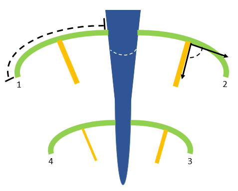

 **Hierarchy Visualization**

 We output a geometric skeleton representing the branching structure of the root (a .ply file), an annotation file which labels each vertex of the skeleton with the hierarchy level (a .txt file), and a surface mesh used to visualize the surrounding shape around the skeleton (a .off file). These files can be loaded into the graphical user interface described below. 

## Graphical User Interface

Included with this repository is a graphical user interface which can be used to visualize the results. Here is a step-by-step walkthrough:

1. Navigate to the TopoRoot/gui/ directory, and double click on the root_mesh_viewer application. This will open the user interface. Click on select .ply and select .txt to load the outputs of TopoRoot.

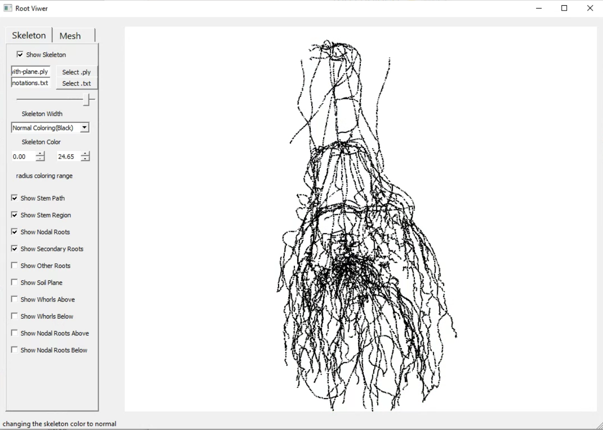

2. Switch to the Mesh tab, and click Select .off . Select the .off file with the same name as the .ply file (the name of your sample).

After clicking open, the surrounding shape (the result of topological simplification) will be loaded in.

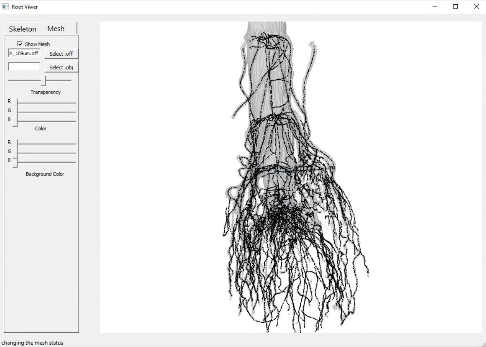

3. To view the hierarchy level, change the "Skeleton Color" option from Normal Coloring(Black) to Color by Hierarchy. Cooler colors (dark blue) represent lower hierarchy levels (starting from the stem), while warmer colors (green, yellow, red, etc.) represent higher hierarchy levels (higher-order lateral roots).

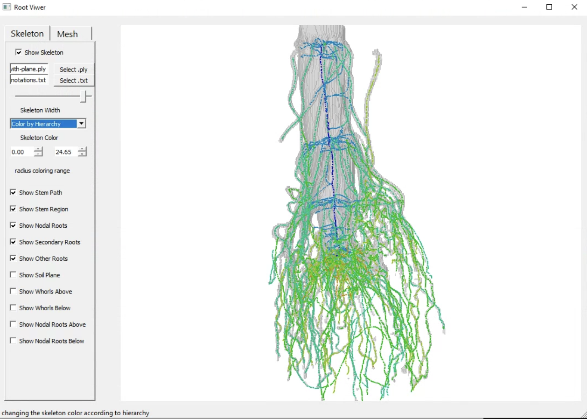

Mouse controls:
* Rotate: drag left mouse button
* Translate: drag right mouse button
* Zoom: Click down on middle scroll of the mouse, and drag up and down.

4. To filter the view of the hierarchy, toggle the checkboxes in the left panel of the Skeleton tab. For example to only view the stem path uncheck the other boxes.

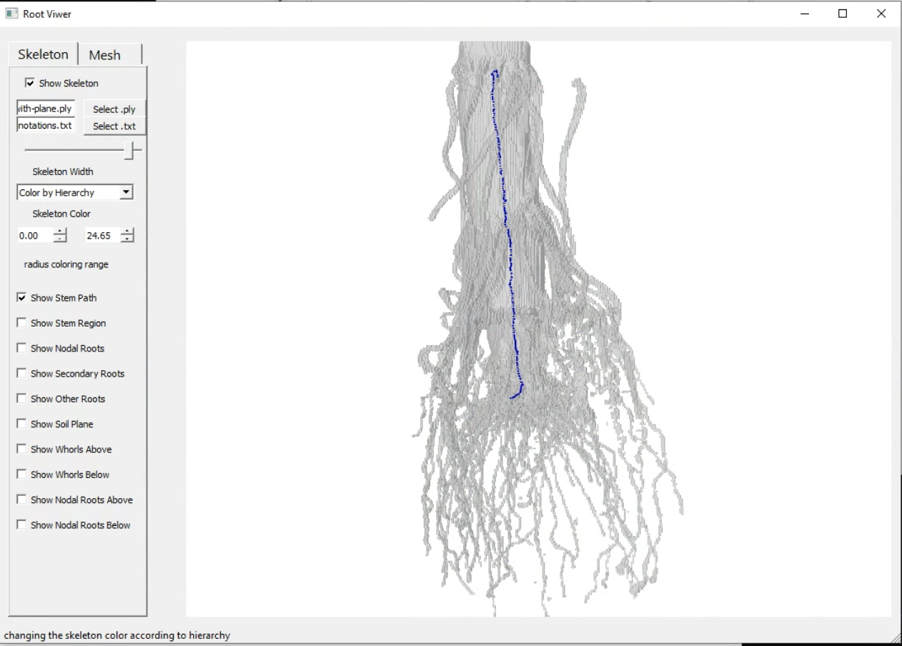

5. If the --plane option was run, then the annotation file will come with the location of the soil plane and whorls. These can be toggled as well in the left panel of the Skeleton tab.

Soil plane:
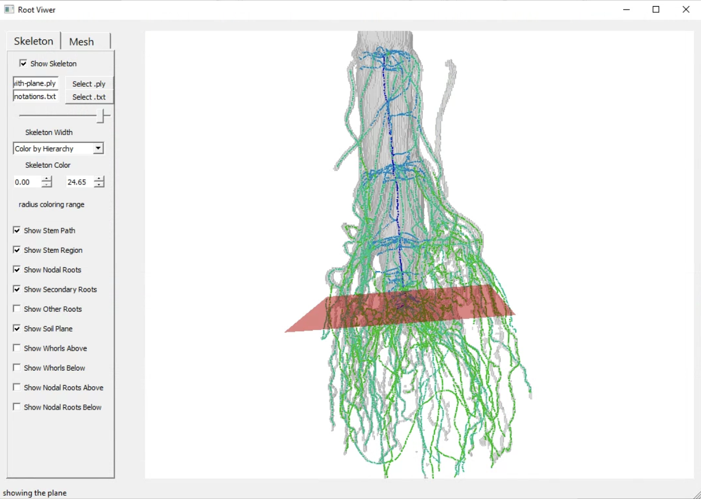

Roots above and below soil:
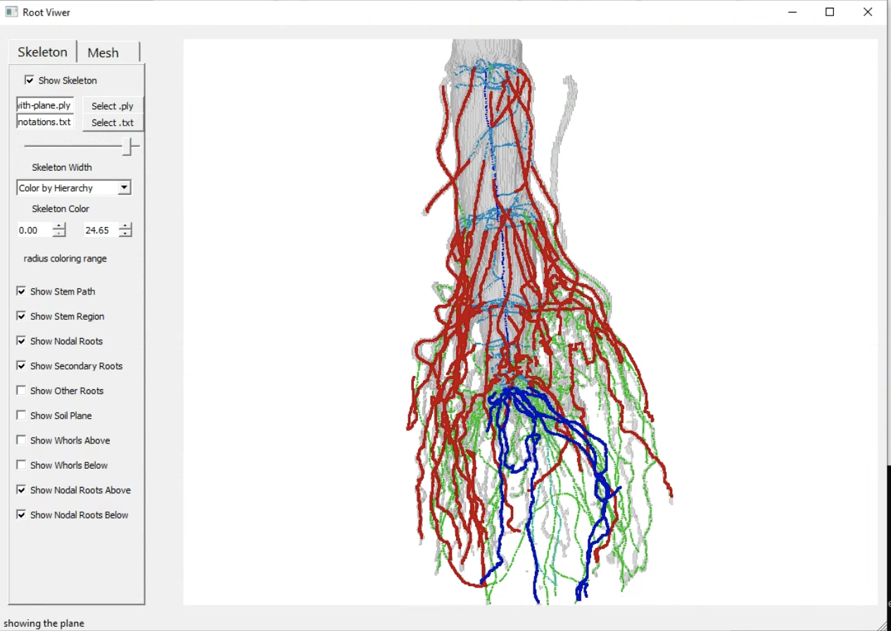

Whorls:
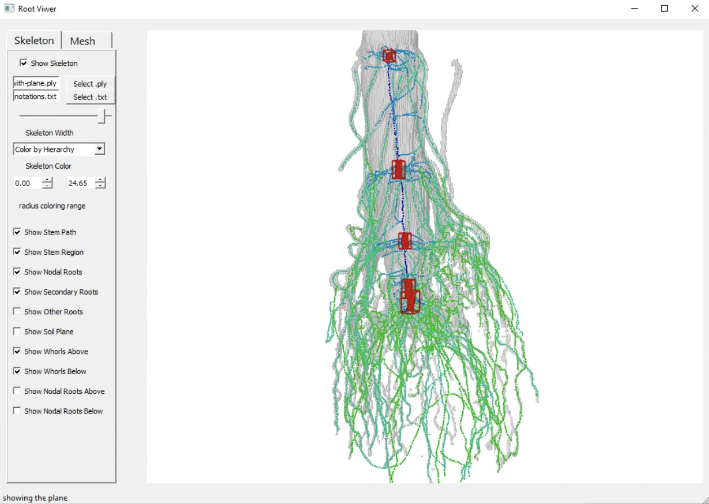

## Picking the shape, kernel, and neighborhood thresholds.

At a minimum, our pipeline takes as input a shape threshold (--S) which represents the iso-value of the iso-surface from which an initial segmentation is produced. The iso-surface at *S* should generally capture the geometry of the root, and provide a balance between capturing thick and thin roots. However, it is okay for noise to be present, since our pipeline is meant to address topological issues including disconnected components, cycles, and empty voids (see picture below). We additionally ask for a kernel threshold (--K, the lowest value that avoids merging of thick roots) and a neighborhood threshold (--N, the highest value that avoids disconnecting thin roots), such that the increasing ordering of the three thresholds are neighborhood, shape, and kernel. Our method will attempt to fix topological errors at the shape threshold guided by the neighborhood and kernel thresholds. For X-ray CT images of corn roots, our code automatically provides default values of *K* and *N* which work well in practice (see source code for more details on the defaults), but for other applications and for further refinement of the hierarchy quality, we recommend the steps below. Further details can be found in the paper.

*An example of possible choices for n, s, and k*
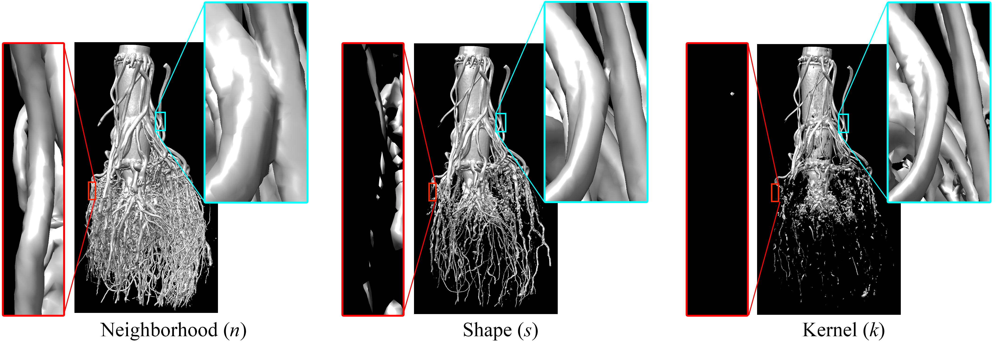

To determine the three iso-values, we highly recommend opening the grayscale image slices in a 3D volume visualization software such as [`UCSF Chimera`](https://www.cgl.ucsf.edu/chimera/), a visualization software developed for the biomedical imaging community. 

Opening the input / output: After opening up the UCSF Chimera Software, go to File > Open.  If the input / output is a sequence of .png image slices in a directory (Chimera does not support .raw files currently), navigate to that directory in the file browser, then shift + drag your mouse to select all the .png slices in the directory. Click Open in the file browser.

Visualizing the shape:

Go to Tools > Volume Data > Volume Viewer. Then in the Volume Viewer window change Style to "surface", step size to "1", and drag the iso-surface bar to the shape threshold.

*Visualizing the iso-surface of a corn root. Dragging the histogram bar can be a good way to determine s, k, and n*
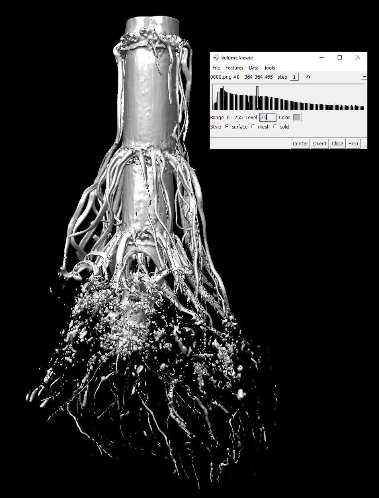

Note that if the volume is particularly huge (greater than about 800^3), you may consider changing the step size to "2" or lower. The step size offers a balance between speed and resolution.

## Acknowledgements

* This material is based upon work supported by the National Science Foundation under Award number: DBI-1759796 (Collaborative Research: ABI Innovation: Algorithms for recovering root architecture from 3D imaging)
* I am funded by the Imaging Sciences Pathway Fellowship from Washington University in St. Louis

I would like to thank the following people for their support, input, and collaboration:

* Christopher Topp
* Yiwen Ju
* Mao Li
* Ni Jiang
* David Letscher
* Erin Chambers
* Hannah Schreiber
* Tim Brown
* Dhinesh Thiruppathi
* Shayla Gunn
* Tiffany Hopkins
* Mon-Ray Shao
* Keith Duncan
* Elisa Morales
* Mitchell Sellers
* Tao Ju
* Gustavo Gratacos
* Yajie Yan

## References:

To cite this work:

* Zeng, D., Li, M., Jiang, N. et al. TopoRoot: a method for computing hierarchy and fine-grained traits of maize roots from 3D imaging. Plant Methods 17, 127 (2021). https://doi.org/10.1186/s13007-021-00829-z

References to other works:

* Dan Zeng, Erin Chambers, David Letscher, and Tao Ju. 2020. To cut or to fill: a global optimization approach to topological simplification. ACM Trans. Graph. 39, 6 (2020), 201.
	* [Project Website](https://danzeng8.github.io/topo-simplifier/)

* Mao Li, Mon-Ray Shao, Dan Zeng, Tao Ju, Elizabeth A. Kellogg, Christopher N. Topp. 2020. 	
Comprehensive 3D phenotyping reveals continuous morphological variation across genetically diverse sorghum inflorescences. New Phytologist, 226: 1873-1885.
	* [Journal Cover](https://nph.onlinelibrary.wiley.com/toc/14698137/2020/226/6)
	* News coverage in [Danforth](https://www.danforthcenter.org/news/looking-inside-grass-flowers/) and at [Wash U](https://engineering.wustl.edu/news/2020/3D-images-allow-detailed-insight-into-grasses.html)

* Yajie Yan, David Letscher, and Tao Ju. 2018. Voxel Cores: Efficient, robust, and provably good approximation of 3D medial axes. ACM Trans. Graph. 37, 4 (2018), 44.
	* [Project website](https://yajieyan.github.io/project/voxelcore/)

* Yajie Yan, Kyle Sykes, Erin Chambers, David Letscher, and Tao Ju. 2016. Erosion Thickness on Medial Axes of 3D Shapes. ACM Trans. Graph. 35, 4 (2016), 38.
	* [Project website](https://yajieyan.github.io/project/et/)

* Zeng, Dan. "TopoRoot: An automatic pipeline for plant architectural analysis from 3D Imaging." North American Plant Phenotyping Network Conference, 16-19 February 2021. Lightning Talk. 

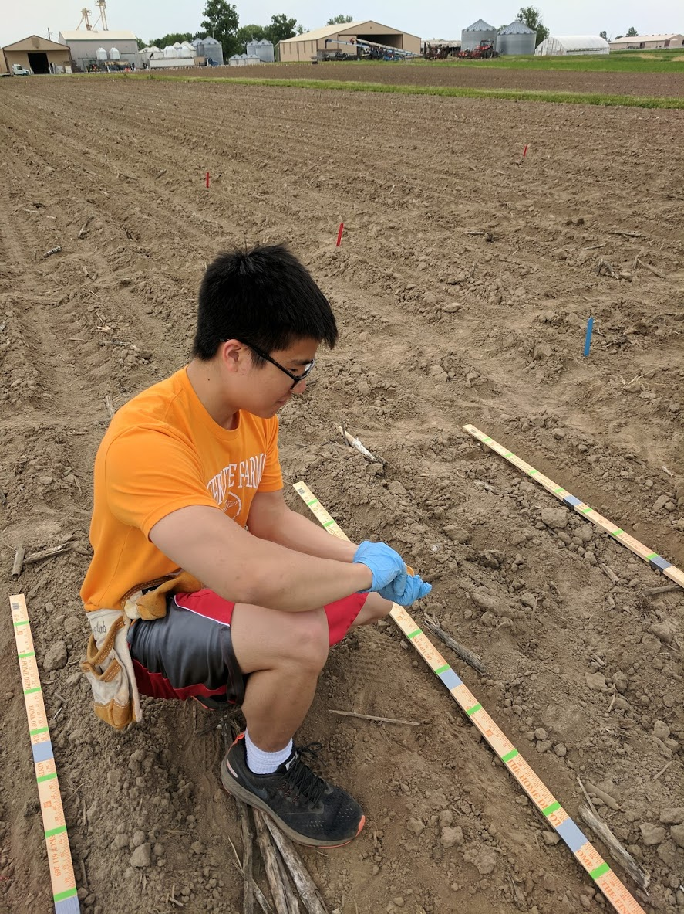

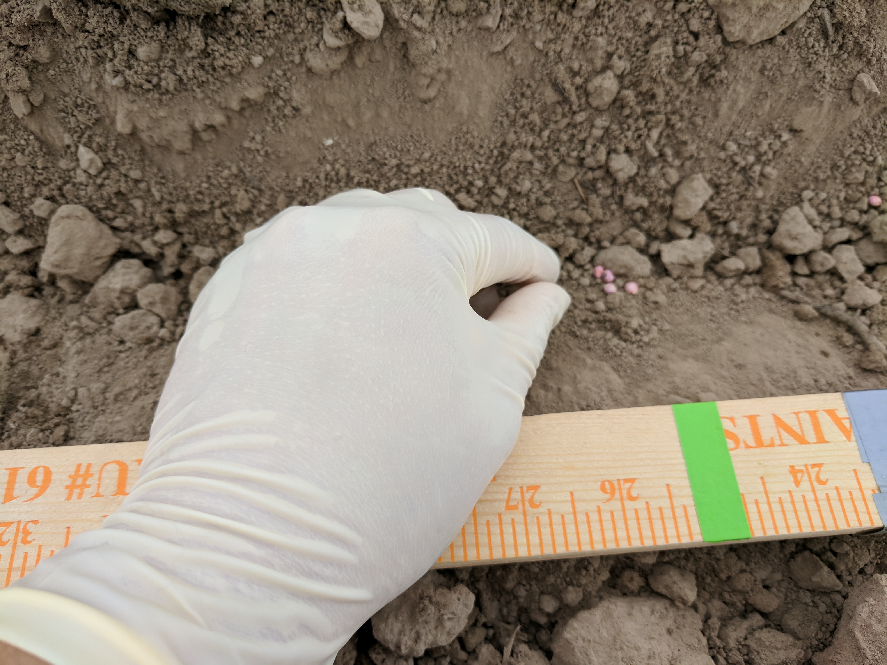

Planting sorghum seeds on internship with Chris Topp ‘s lab at DDPSC, May 2018; where the pipeline truly begins!

