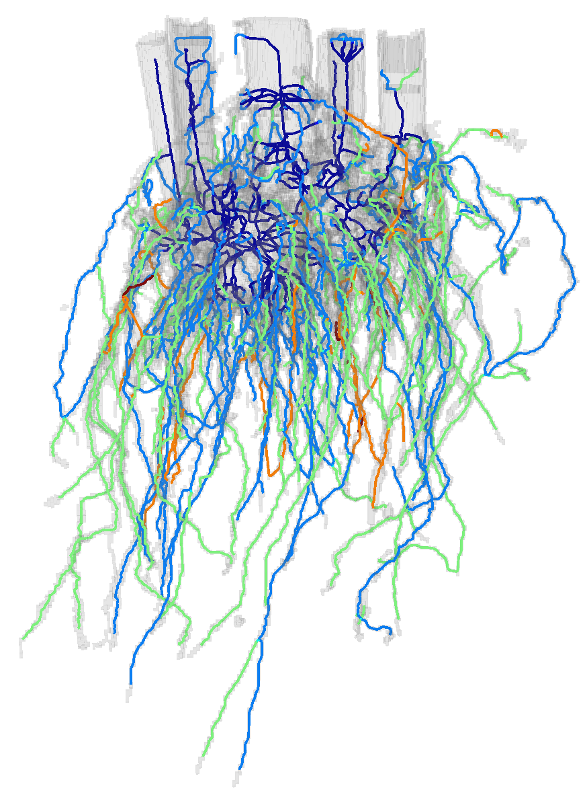
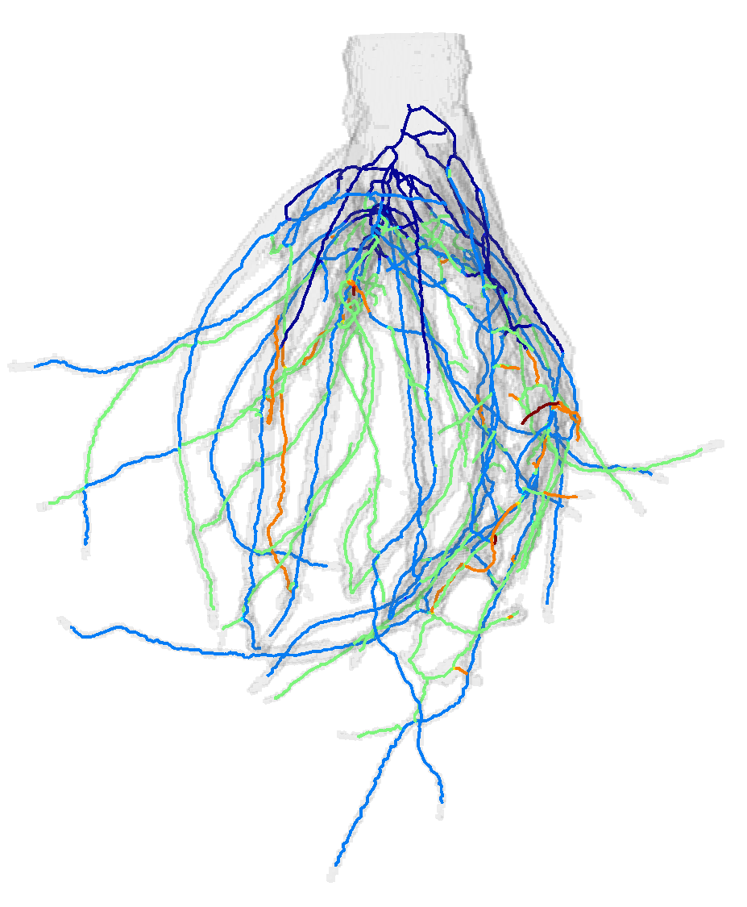

# TopoRoot: An automatic pipeline for plant architectural analysis from 3D Imaging

## Introduction
TopoRoot is a pipeline of geometric algorithms for automatically obtaining architectural traits from 3D grayscale images of plant structures both above and below the soil, with high accuracy and throughput. Our pipeline may be applied to batch process large numbers of 3D images, potentially for the purpose of genetic phenotyping studies, or can be applied to individual images. For the first time, we bring state-of-the-art techniques from computer graphics to resolve several topological and geometric issues which are frequently encountered in image-to-analysis pipelines for plant phenotyping. These contributions include:
* The removal of excessive topological features from the shape which is reconstructed from the imaging. These topological features include merged branches, disconnected components, noise, and internal voids, which are removed by our pipeline with minimal geometric change, using the method in [Zeng et. al, 2020].
* The representation of the plant structure by a curve skeleton known as the medial axis. This allows for a compact graph representation of the plant's structure using nodes and edges, while also encoding shape information such as thickness and width. These characteristics make our pipeline more amenable to computing architecture. We use the medial axis computation and skeleton pruning techniques introduced in [Yan et. al, 2018] and [Yan et. al, 2016].
* A novel algorithm for computing the hierarchy of the plant structure, which recursively minimizes that maximum branching depth of the predicted structure of the plant at each hierarchy level. Our algorithm also considers branch length and angle continuity.
* An algorithm for identifying the stem / tiller of the plant structure which uses the thickness information along the medial axis. This was previously used in [Li et. al, 2020] as a step of the algorithm to identify primary branches, as part of a comprehensive 3D phenotypic study which revealed continuous morphological variation across diverse sorghum influorescences. Here we extend the stem identification algorithm to also be able to track multiple tillers, which can be seen in structures such as sorghum roots

Further details about these steps can be found in our ['NAPPN presentation (National Plant Phenotyping Network Conference 2021)'](https://github.com/danzeng8/TopoRoot/blob/master/pics/NAPPN_2021_danzeng.pptx)

## Results and Examples

As part of an ongoing genome-wide large-scale study to discover the genes that play a role in Sorghum root and panicle architecture, we have (so far) batch processed over 700 roots and 500 panicles coming from more than 200 varieties of the Sorghum Association Panel.

## Installation

The steps of installation consist of downloading this code repository, building a few C++ projects, and ensuring the proper python version is installed. The pipeline currently only builds and operates on Windows. 

1. Download this repository by either clicking on Code > Download Zip in the top right, and then unzipping, or by using the git clone https://github.com/danzeng8/TopoRoot.git command.

Before proceeding to the other installation instructions, try just running the pipeline. This repository comes with pre-built executable software configured for a Windows 10 machine, which may work or not work on your machine.

Try running the following command, after navigating to the root_pipeline directory using the 'cd' command on the Windows command prompt:

python root_pipeline.py -i example_root/in/ -o example_root/out/ -d 6

If successful, this will produce a .ply file, .csv file, and .off file in the example_root/out/ directory within 5-10 minutes. Otherwise, if the run fails, continue onto the next steps.

2. ['Install Visual Studio 2019'](https://visualstudio.microsoft.com/downloads/), if it is not already installed. The free community version will work just fine.

3. Navigate to the TopoRoot/TopoSimplifier directory, and click to open the TopoSimplifier.sln directory. In the top of the Visual Studio Window, change the build mode to 'Release' and architecture to x64.

Then, go to Project > Properties. This is where the Windows SDK Version and Platform Toolset will depend on your machine. If you are using Visual studio 2019, then try v142 for the platform toolset (v141 for VS 2017, v140 for VS 2015). Windows SDK version 10.0 is the latest installed version on my machine (a Windows 10), however I have also seen Windows 8 SDK to work instead on older machines (sometimes even if they are Windows 10). Apply the changes in the property window.

Next, in the Visual Studio menu go to Build > Build Solution. If successful, there will be no errors in the Visual Studio window, and it will also update the .exe file in the main repository directory (called TopoSimplifier.exe). Note that "Date modified" should update to date and time of the successful installation. Otherwise, keep tweaking the Project properties as in the above - assuming a Windows 8 or 10 machine, there should be an appropriate combination of platform toolset and Windows SDK version which will allow for a successful builds.

4. Make sure the simpleDictionaryFull.bin file in the TopoSimplifier directory is completely downloaded (ALL 131,072 Kb of it). If it is not, click ['here'](https://github.com/danzeng8/TopoRoot/blob/master/TopoSimplifier/simpleDictionaryFull.bin) to download the full file, and replace the incomplete one in the TopoSimplifier directory.  

5. Click ['here'](https://github.com/danzeng8/root_traits_auto) to download the root_traits_auto source code. Open the root_traits_auto.sln file. Follow the corresponding directions from step 3 to build the project. Following a successful build, root_traits_auto.exe will be updated in the main root_traits_auto folder. Copy root_traits_auto.exe and paste it into the TopoRoot directory.

6. Install python version 3.9 ['here'](https://www.python.org/downloads/release/python-390/). Add python to your windows path. There are many instructions online on how to do this, including ['here'](https://datatofish.com/add-python-to-windows-path/).

7. Try running the following command, after navigating to the root_pipeline directory using the 'cd' command on the Windows command prompt:

python root_pipeline.py -i example_root/in/ -o example_root/out/ -d 6

If successful, this will produce a .ply file, .csv file, and .off file in the example_root/out/ directory within 5-10 minutes. Otherwise, if the run fails, make sure that the previous steps are performed correctly.

Among other potential errors, you may see an error such as "Import Error: No module named networkx". In these cases the error is due to a python module not being installed. This can be fixed by running "pip install [insert_module_name]"" on the windows command prompt, such as "pip install networkx" in the above case. 

If you encounter any further issues, please contact me (Dan Zeng) at danzeng8@gmail.com. 

## Running the pipeline

This pipeline can be run either in batch (a directory), or one file at a time. 

To run in batch, runroot_pipeline_batch.py as follows:

python root_pipeline_batch.py -i <input directory> -o <output directory> -d <downsampling rate>

Example:
python root_pipeline_batch.py -i C:/Users/danzeng/Sorghum/Roots/batch/ -o C:/Users/danzeng/Sorghum/Roots/batch_out/ -d 6

Our pipeline currently takes two possible types of inputs: raw files and image slices. 
* If the input is a folder containing raw files, then for each .raw file in the folder it must also have a corresponding .dat file in the same directory, with the exact same name (besides the extension). 
* If the input is a folder containing sub-folders of image slices, then there are no other requirements.

For the downsampling rate (-d), choose a rate such that the downsampled image is less than 400^3 in dimensions. This will help to prevent any speed issues. For example if the original image volumes are 1800^3 in dimensions, a downsampling rate of 6 may be used to produce downsampled images, each of size 300^3. 

After a successful run using batch processing, the output folder will contain a .ply file and .off file for each sample, and an excel file (.csv) with trait statistics. See the section below this one for details on these files.

The pipeline may also be run in on individual 3D image samples, without batch processing. This can be done by running the root_pipeline.py script as follows:

python root_pipeline.py -i <input directory> -o <output directory> -d <downsampling rate>

This will produce a single .ply file, .off file, and excel file (.csv).

There are additional optional arguments to this pipeline depending on the desired setting and application. These include parameters for the degree of topological repair and stem identification. Please contact me at danzen8@gmail.com for further details. 

## Understanding the output

Our pipeline produces one trait file (.csv) which encompasses the statistics across all samples processed, and also visualization mesh files to show the skeleton hierarchy (.ply and .off). 

For each sample, and for  each hierarchy level of the plant structure (levels 1-5), we output the following traits:

* Branch count
* Average length
* Average geodesic depth
* Average thickness
* Number of skeleton edges
* Average tortuosity
* Angle to gravity
* Angle to parent branch
* Tip angle
* Emergence angle
* Midpoint angle

These traits are not only averaged across each hierarchy level, but also averaged for the whole sample (as the last few data entries in each row, for each sample).

Specifically, the structure and format of the output excel file can be found below. Each row of the excel sheet represents the traits for one sample. Hierarchy levels 1-5 will occupy most columns, while the last several columns are reserved for aggregated traits for the whole sample.

Format of the output .csv file: 

Sample 1 Name, level 1 branch count, level 1 average length, level 1 average geodesic depth, level 1 average radius, level 1 number of skeleton edges, level 1 average tortuosity, level 1 angle to gravity, level 1 angle to parent, level 1 tip angle, level 1 emergence angle, level 1 midpoint angle, level 1 branch children, level 2 branch count, level 2 average length, level 2 average geodesic depth, level 2 average radius, level 2 number of skeleton edges, level 2 average tortuosity, level 2 angle to gravity, level 2 angle to parent, level 2 tip angle, level 2 emergence angle, level 2 midpoint angle, level 2 branch children, level 3 branch count, level 3 average length, level 3 average geodesic depth, level 3 average radius, level 3 number of skeleton edges, level 3 average tortuosity, level 3 angle to gravity, level 3 angle to parent, level 3 tip angle, level 3 emergence angle, level 3 midpoint angle, level 3 branch children, level 4 branch count, level 4 average length, level 4 average geodesic depth, level 4 average radius, level 4 number of skeleton edges, level 4 average tortuosity, level 4 angle to gravity, level 4 angle to parent, level 4 tip angle, level 4 emergence angle, level 4 midpoint angle, level 4 branch children, level 5 branch count, level 5 average length, level 5 average geodesic depth, level 5 average radius, level 5 number of skeleton edges, level 5 average tortuosity, level 5 angle to gravity, level 5 angle to parent, level 5 tip angle, level 5 emergence angle, level 5 midpoint angle, level 5 branch children, 
total branch length, total number of branches, total average branch length, total skeleton edges, average angle to gravity, average parent angle, average tip angle, average emergence angle, average midpoint angle, average number of children

...

Sample 2 Name, level 1 branch count, level 1 average length, level 1 average geodesic depth, level 1 average radius, level 1 number of skeleton edges, level 1 average tortuosity, level 1 angle to gravity, level 1 angle to parent, level 1 tip angle, level 1 emergence angle, level 1 midpoint angle, level 1 branch children, level 2 branch count, level 2 average length, level 2 average geodesic depth, level 2 average radius, level 2 number of skeleton edges, level 2 average tortuosity, level 2 angle to gravity, level 2 angle to parent, level 2 tip angle, level 2 emergence angle, level 2 midpoint angle, level 2 branch children, level 3 branch count, level 3 average length, level 3 average geodesic depth, level 3 average radius, level 3 number of skeleton edges, level 3 average tortuosity, level 3 angle to gravity, level 3 angle to parent, level 3 tip angle, level 3 emergence angle, level 3 midpoint angle, level 3 branch children, level 4 branch count, level 4 average length, level 4 average geodesic depth, level 4 average radius, level 4 number of skeleton edges, level 4 average tortuosity, level 4 angle to gravity, level 4 angle to parent, level 4 tip angle, level 4 emergence angle, level 4 midpoint angle, level 4 branch children, level 5 branch count, level 5 average length, level 5 average geodesic depth, level 5 average radius, level 5 number of skeleton edges, level 5 average tortuosity, level 5 angle to gravity, level 5 angle to parent, level 5 tip angle, level 5 emergence angle, level 5 midpoint angle, level 5 branch children, 
total branch length, total number of branches, total average branch length, total skeleton edges, average angle to gravity, average parent angle, average tip angle, average emergence angle, average midpoint angle, average number of children

....

Sample N Name, level 1 branch count, level 1 average length, level 1 average geodesic depth, level 1 average radius, level 1 number of skeleton edges, level 1 average tortuosity, level 1 angle to gravity, level 1 angle to parent, level 1 tip angle, level 1 emergence angle, level 1 midpoint angle, level 1 branch children, level 2 branch count, level 2 average length, level 2 average geodesic depth, level 2 average radius, level 2 number of skeleton edges, level 2 average tortuosity, level 2 angle to gravity, level 2 angle to parent, level 2 tip angle, level 2 emergence angle, level 2 midpoint angle, level 2 branch children, level 3 branch count, level 3 average length, level 3 average geodesic depth, level 3 average radius, level 3 number of skeleton edges, level 3 average tortuosity, level 3 angle to gravity, level 3 angle to parent, level 3 tip angle, level 3 emergence angle, level 3 midpoint angle, level 3 branch children, level 4 branch count, level 4 average length, level 4 average geodesic depth, level 4 average radius, level 4 number of skeleton edges, level 4 average tortuosity, level 4 angle to gravity, level 4 angle to parent, level 4 tip angle, level 4 emergence angle, level 4 midpoint angle, level 4 branch children, level 5 branch count, level 5 average length, level 5 average geodesic depth, level 5 average radius, level 5 number of skeleton edges, level 5 average tortuosity, level 5 angle to gravity, level 5 angle to parent, level 5 tip angle, level 5 emergence angle, level 5 midpoint angle, level 5 branch children, total branch length, total number of branches, total average branch length, total skeleton edges, average angle to gravity, average parent angle, average tip angle, average emergence angle, average midpoint angle, average number of children,
total branch length, total number of branches, total average branch length, average tortuosity, total skeleton edges, average angle to gravity, average parent angle, average tip angle, average emergence angle, average midpoint angle, average number of children