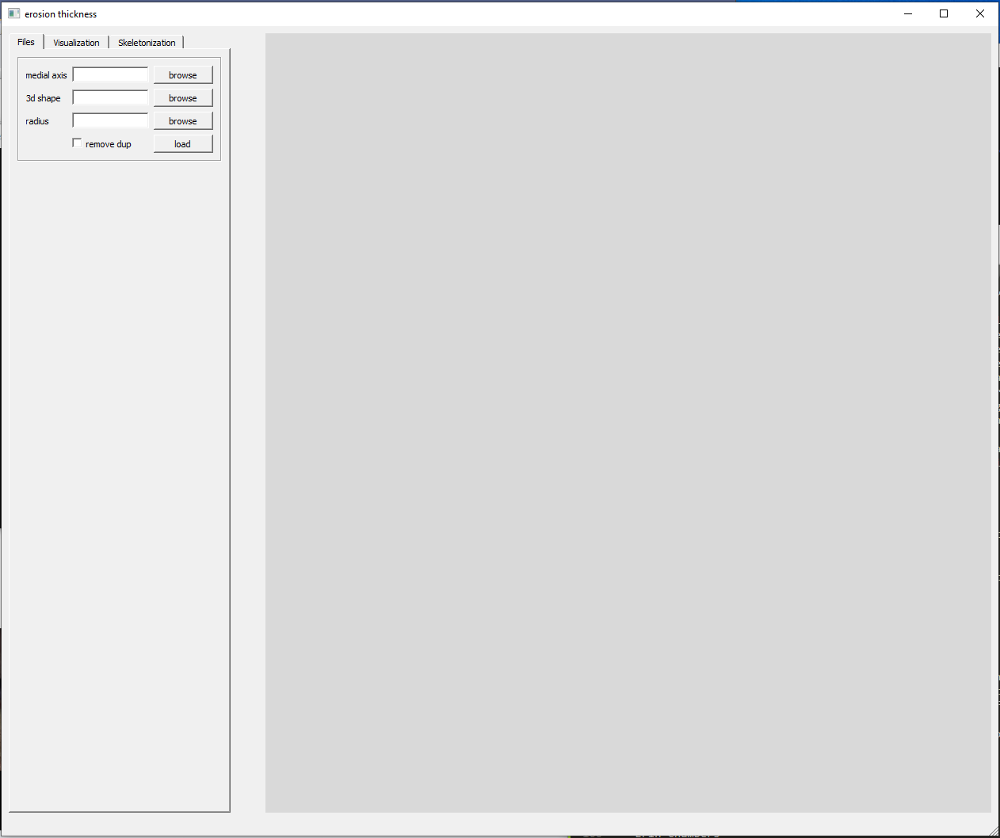
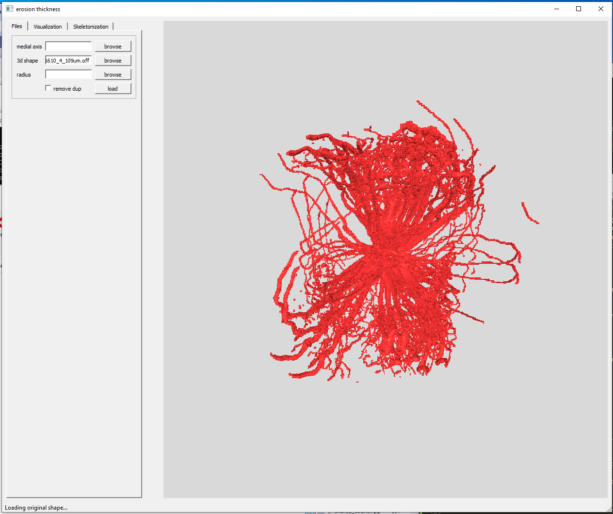
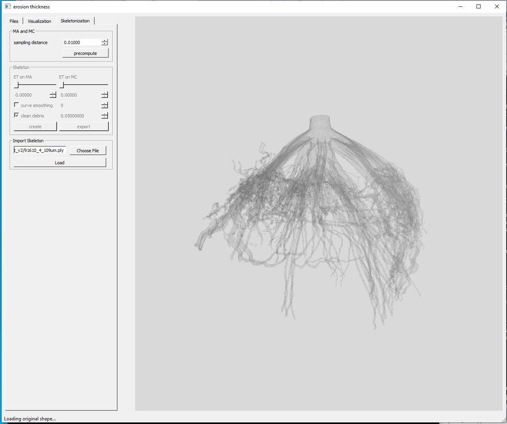
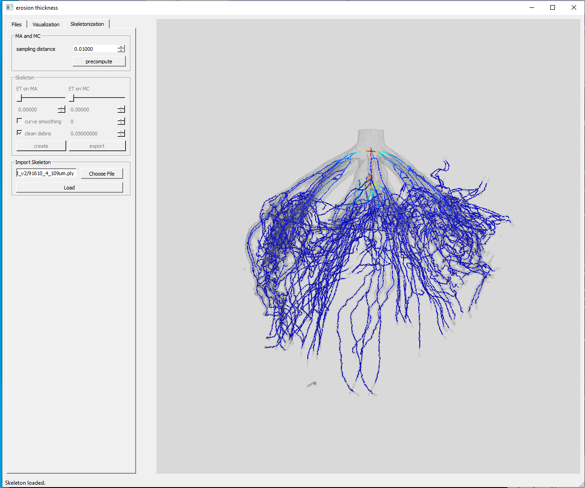
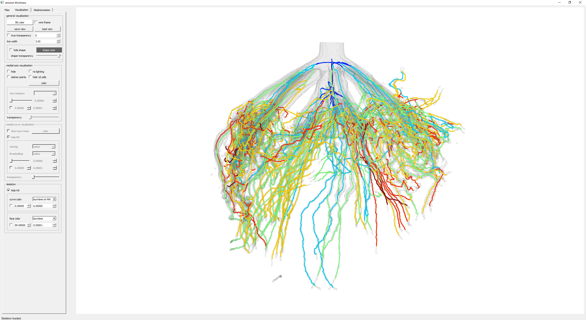

# TopoRoot: An automatic pipeline for plant architectural analysis from 3D Imaging

## Introduction

TopoRoot is a high-throughput computational method that computes fine-grained architectural traits from 3D CT images of excavated maize root crowns. These traits include the number, length, thickness, angle, tortuosity, and number of children for the roots at each level of the hierarchy. TopoRoot combines state-of-the-art algorithms in computer graphics, such as topological simplification and geometric skeletonization, with customized heuristics for robustly obtaining the branching structure and hierarchical information.

## Installation and Execution

Open up command prompt, clone the repository (git clone https://github.com/danzeng8/TopoRoot.git), then navigate to the main directory. TopoRoot can be run as follows. The first three arguments are required, while the rest are optional:

TopoRoot --in [input_file] --out [output_file] --S [shape] --K [kernel] --N [neighborhood] --d [downsampling rate] --plane

Required arguments: 

--in : directory where image slices are located (e.g. C:/data/image_slices/), or a .raw file. If the input is a .raw file, an accompanying .dat file must be specified in the command (--dat [file.dat]).

--out  : Specifies the location and names of the output files. If the argument value is directory/output_file_name, then the three output files are named as directory/output_file_name.ply (geometric skeleton), directory/output_file_annotations.txt (annotation file), and directory/output_file.off (Surface mesh for visualization)

--S : Shape iso-value.

If you encounter any further issues, please contact me (Dan Zeng) at danzeng8@gmail.com or file an issue on Github. 

## Running the pipeline

This pipeline can be run either in batch (a directory), or one file at a time. 

To run in batch, run toporoot_batch.py as follows:

`python toporoot_batch.py -i <input directory> -o <output directory> -d <downsampling rate>`

Example:
`python toporoot_batch.py -i C:/Users/danzeng/Sorghum/Roots/batch/ -o C:/Users/danzeng/Sorghum/Roots/batch_out/ -d 6`

Our pipeline currently takes two possible types of inputs: raw files and image slices. 
* If the input is a folder containing raw files, then for each .raw file in the folder it must also have a corresponding .dat file in the same directory, with the exact same name (besides the extension). 
* If the input is a folder containing sub-folders of image slices, then there are no other requirements.

For the downsampling rate (-d), choose a rate such that the downsampled image is less than 400^3 in dimensions. This will help to prevent any speed issues. For example if the original image volumes are 1800^3 in dimensions, a downsampling rate of 6 may be used to produce downsampled images, each of size 300^3. 

After a successful run using batch processing, the output folder will contain a .ply file and .off file for each sample, and an excel file (.csv) with trait statistics. See the section below this one for details on these files.

The pipeline may also be run in on individual 3D image samples, without batch processing. This can be done by running the toporoot.py script as follows:

`python toporoot.py -i <input directory> -o <output directory> -d <downsampling rate>`

This will produce a single .ply file, .off file, and excel file (.csv).

There are additional optional arguments to this pipeline depending on the desired setting and application. These include parameters for the degree of topological repair and stem identification. Please contact me at danzeng8@gmail.com for further details. 

## Understanding the output

Our pipeline produces one trait file (.csv) which encompasses the statistics across all samples processed, and also visualization mesh files to show the skeleton hierarchy (.ply and .off). 

For each sample, and for  each hierarchy level of the plant structure (levels 1-5), we output the following traits:

* Branch count
* Average length
* Average geodesic depth
* Average thickness
* Number of skeleton edges
* Average tortuosity
* Angle to gravity
* Angle to parent branch
* Tip angle
* Emergence angle
* Midpoint angle

These traits are not only averaged across each hierarchy level, but also averaged for the whole sample (as the last few data entries in each row, for each sample).

Specifically, the structure and format of the output excel file can be found below. Each row of the excel sheet represents the traits for one sample. Hierarchy levels 1-5 will occupy most columns, while the last several columns are reserved for aggregated traits for the whole sample.

Format of the output .csv file: 

Sample 1 Name, level 1 branch count, level 1 average length, level 1 average geodesic depth, level 1 average radius, level 1 number of skeleton edges, level 1 average tortuosity, level 1 angle to gravity, level 1 angle to parent, level 1 tip angle, level 1 emergence angle, level 1 midpoint angle, level 1 branch children, level 2 branch count, level 2 average length, level 2 average geodesic depth, level 2 average radius, level 2 number of skeleton edges, level 2 average tortuosity, level 2 angle to gravity, level 2 angle to parent, level 2 tip angle, level 2 emergence angle, level 2 midpoint angle, level 2 branch children, level 3 branch count, level 3 average length, level 3 average geodesic depth, level 3 average radius, level 3 number of skeleton edges, level 3 average tortuosity, level 3 angle to gravity, level 3 angle to parent, level 3 tip angle, level 3 emergence angle, level 3 midpoint angle, level 3 branch children, level 4 branch count, level 4 average length, level 4 average geodesic depth, level 4 average radius, level 4 number of skeleton edges, level 4 average tortuosity, level 4 angle to gravity, level 4 angle to parent, level 4 tip angle, level 4 emergence angle, level 4 midpoint angle, level 4 branch children, level 5 branch count, level 5 average length, level 5 average geodesic depth, level 5 average radius, level 5 number of skeleton edges, level 5 average tortuosity, level 5 angle to gravity, level 5 angle to parent, level 5 tip angle, level 5 emergence angle, level 5 midpoint angle, level 5 branch children, total branch length, total number of branches, total average branch length, average tortuosity, total skeleton edges, average angle to gravity, average parent angle, average tip angle, average emergence angle, average midpoint angle, average number of children

...

Sample 2 Name, level 1 branch count, level 1 average length, level 1 average geodesic depth, level 1 average radius, level 1 number of skeleton edges, level 1 average tortuosity, level 1 angle to gravity, level 1 angle to parent, level 1 tip angle, level 1 emergence angle, level 1 midpoint angle, level 1 branch children, level 2 branch count, level 2 average length, level 2 average geodesic depth, level 2 average radius, level 2 number of skeleton edges, level 2 average tortuosity, level 2 angle to gravity, level 2 angle to parent, level 2 tip angle, level 2 emergence angle, level 2 midpoint angle, level 2 branch children, level 3 branch count, level 3 average length, level 3 average geodesic depth, level 3 average radius, level 3 number of skeleton edges, level 3 average tortuosity, level 3 angle to gravity, level 3 angle to parent, level 3 tip angle, level 3 emergence angle, level 3 midpoint angle, level 3 branch children, level 4 branch count, level 4 average length, level 4 average geodesic depth, level 4 average radius, level 4 number of skeleton edges, level 4 average tortuosity, level 4 angle to gravity, level 4 angle to parent, level 4 tip angle, level 4 emergence angle, level 4 midpoint angle, level 4 branch children, level 5 branch count, level 5 average length, level 5 average geodesic depth, level 5 average radius, level 5 number of skeleton edges, level 5 average tortuosity, level 5 angle to gravity, level 5 angle to parent, level 5 tip angle, level 5 emergence angle, level 5 midpoint angle, level 5 branch children, total branch length, total number of branches, total average branch length, average tortuosity, total skeleton edges, average angle to gravity, average parent angle, average tip angle, average emergence angle, average midpoint angle, average number of children

....

Sample N Name, level 1 branch count, level 1 average length, level 1 average geodesic depth, level 1 average radius, level 1 number of skeleton edges, level 1 average tortuosity, level 1 angle to gravity, level 1 angle to parent, level 1 tip angle, level 1 emergence angle, level 1 midpoint angle, level 1 branch children, level 2 branch count, level 2 average length, level 2 average geodesic depth, level 2 average radius, level 2 number of skeleton edges, level 2 average tortuosity, level 2 angle to gravity, level 2 angle to parent, level 2 tip angle, level 2 emergence angle, level 2 midpoint angle, level 2 branch children, level 3 branch count, level 3 average length, level 3 average geodesic depth, level 3 average radius, level 3 number of skeleton edges, level 3 average tortuosity, level 3 angle to gravity, level 3 angle to parent, level 3 tip angle, level 3 emergence angle, level 3 midpoint angle, level 3 branch children, level 4 branch count, level 4 average length, level 4 average geodesic depth, level 4 average radius, level 4 number of skeleton edges, level 4 average tortuosity, level 4 angle to gravity, level 4 angle to parent, level 4 tip angle, level 4 emergence angle, level 4 midpoint angle, level 4 branch children, level 5 branch count, level 5 average length, level 5 average geodesic depth, level 5 average radius, level 5 number of skeleton edges, level 5 average tortuosity, level 5 angle to gravity, level 5 angle to parent, level 5 tip angle, level 5 emergence angle, level 5 midpoint angle, level 5 branch children, total branch length, total number of branches, total average branch length, average tortuosity, total skeleton edges, average angle to gravity, average parent angle, average tip angle, average emergence angle, average midpoint angle, average number of children

## Visualization of the output

Included with this repository is a graphical user interface which can be used to visualize the results. Here is a step-by-step walkthrough:

1. Navigate to the TopoRoot/et/ directory, and double click on the EtDev application. This will open the user interface:

3. Next to "3d shape", click browse. Select the .off file with the same name as the .ply file (the name of your sample).

After clicking open, the shape will be loaded in:

You will likely want to re-orient the visualization a bit to get a better view. Mouse controls:
* Rotate: drag left mouse button
* Translate: drag right mouse button
* Zoom: Click down on middle scroll of the mouse, and drag up and down. 

4. Now lets make the shape semi-transparent, with the skeleton eventually being shown within it. Go to the visualization tab, select shape color, and enter (100, 100, 100) for Red, Green, and Blue, and click ok. Still in the visualization tab, scale up the shape transparency as desired. Move back to the Skeletonization tab 

2. Loading in the skeleton, let's switch to the Skeletonization tab. Under Import Skeleton, click Choose File and select the skeleton .ply file of the result that you want to visualize:

This will load in a skeleton, initially colored by thickness:

3. Go to the Visualization tab. Under skeleton, change curve color to "burntime on MA". In the same tab you can increase the line width (to say, 3), and change the "BG color" to white. You will now get a visualization which resembles this:

The architecture is now colored by hierarchy level. The "coolest color", in this case blue, represents the portion of the skeleton that is within the stem, as computed by the pipeline. As the color becomes warmer, the visualization is representing higher levels of the hierarchy. For example in this case a lighter cyan blue represents the level 1 branches (e.g. lateral roots), while green represents level 2 branches (secondary roots), and so forth. The color range can be scaled by toggling the minimum and maximum values under the curve color region of the GUI in the visualization tab.

## Acknowledgements

* This material is based upon work supported by the National Science Foundation under Award number: DBI-1759796 (Collaborative Research: ABI Innovation: Algorithms for recovering root architecture from 3D imaging)
* I am funded by the Imaging Sciences Pathway Fellowship from Washington University in St. Louis

I would like to thank the following people for their support, input, and collaboration:

* Chris Topp
* Mon-Ray Shao
* Mao Li
* Keith Duncan
* Ni Jiang
* David Letscher
* Erin Chambers
* Hannah Schreiber
* Tao Ju
* Yiwen Ju
* Gustavo Gratacos
* Yajie Yan

## References:

To cite this pipeline:

Zeng, Dan. "TopoRoot: An automatic pipeline for plant architectural analysis from 3D Imaging." North American Plant Phenotyping Network Conference, 16-19 February 2021. Lightning Talk. 

References to other works:

* Dan Zeng, Erin Chambers, David Letscher, and Tao Ju. 2020. To cut or to fill: a global optimization approach to topological simplification. ACM Trans. Graph. 39, 6 (2020), 201.
	* [Project Website](https://danzeng8.github.io/topo-simplifier/)

* Mao Li, Mon-Ray Shao, Dan Zeng, Tao Ju, Elizabeth A. Kellogg, Christopher N. Topp. 2020. 	
Comprehensive 3D phenotyping reveals continuous morphological variation across genetically diverse sorghum inflorescences. New Phytologist, 226: 1873-1885.
	* [Journal Cover](https://nph.onlinelibrary.wiley.com/toc/14698137/2020/226/6)
	* News coverage in [Danforth](https://www.danforthcenter.org/news/looking-inside-grass-flowers/) and at [Wash U](https://engineering.wustl.edu/news/2020/3D-images-allow-detailed-insight-into-grasses.html)

* Yajie Yan, David Letscher, and Tao Ju. 2018. Voxel Cores: Efficient, robust, and provably good approximation of 3D medial axes. ACM Trans. Graph. 37, 4 (2018), 44.
	* [Project website](https://yajieyan.github.io/project/voxelcore/)

* Yajie Yan, Kyle Sykes, Erin Chambers, David Letscher, and Tao Ju. 2016. Erosion Thickness on Medial Axes of 3D Shapes. ACM Trans. Graph. 35, 4 (2016), 38.
	* [Project website](https://yajieyan.github.io/project/et/)

Planting sorghum seeds on internship with Chris Topp ‘s lab at DDPSC, May 2018; where the pipeline truly begins!

